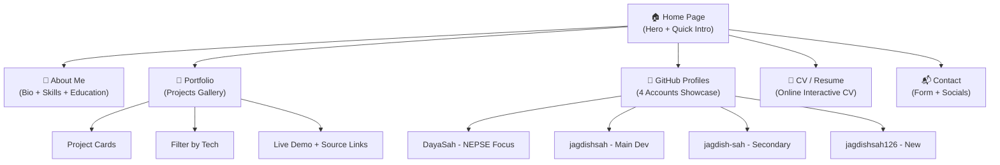

# 🚀 Portfolio Website Roadmap — Jagdish Sah

> **Full Stack Developer with AI Assistance** | BCT 2nd Sem, TU WRC College, Nepal

---

## 📋 Project Summary

| Detail | Value |
|---|---|
| **Name** | Jagdish Sah |
| **Title** | Full Stack Developer with AI Assistance |
| **College** | BCT 2nd Semester, TU WRC College, Nepal |
| **Interests** | NEPSE Trading, Data Analysis, Web App Development |
| **GitHub Accounts** | 4 (DayaSah, jagdishsah, jagdish-sah, jagdishsah126) |
| **Total Public Repos** | ~21+ across all accounts |
| **Deploy Target** | Vercel (free, fast) |
| **Theme** | Dark + Light toggle |

---

## 🛠️ Tech Stack Decision

> [!IMPORTANT]
> I'm choosing **Next.js 14 (App Router) + Tailwind CSS + TypeScript** — here's why:

| Technology | Purpose | Why This Choice |
|---|---|---|
| **Next.js 14** | Framework | Multi-page routing, SSG for speed, Image optimization, perfect Vercel deploy |
| **TypeScript** | Language | Type safety, better DX, industry standard |
| **Tailwind CSS** | Styling | Rapid UI development, dark/light mode built-in, responsive by default |
| **Framer Motion** | Animations | Smooth page transitions, scroll animations, hero effects |
| **Three.js / tsParticles** | Hero 3D Effect | Particle background animation on hero section |
| **next-themes** | Theme Toggle | Seamless dark/light mode switching |
| **Lucide React** | Icons | Beautiful, consistent icon set |
| **Vercel** | Hosting | Zero-config deploy, free tier, perfect Next.js integration |

> [!TIP]
> No backend needed — all content is static/JSON-driven. You can update projects by editing a simple data file.

---

## 🏗️ Site Architecture



---

## 📂 Folder Structure

```
My Profile/
├── public/
│   ├── images/
│   │   ├── profile.jpg          # Your headshot
│   │   └── projects/            # Project screenshots
│   └── favicon.ico
├── src/
│   ├── app/
│   │   ├── layout.tsx           # Root layout with nav + footer
│   │   ├── page.tsx             # Home/Hero page
│   │   ├── about/
│   │   │   └── page.tsx         # About + Skills
│   │   ├── portfolio/
│   │   │   └── page.tsx         # Projects gallery
│   │   ├── github/
│   │   │   └── page.tsx         # GitHub profiles showcase
│   │   ├── cv/
│   │   │   └── page.tsx         # Online CV/Resume
│   │   └── contact/
│   │       └── page.tsx         # Contact form
│   ├── components/
│   │   ├── layout/
│   │   │   ├── Navbar.tsx       # Navigation bar
│   │   │   ├── Footer.tsx       # Footer with socials
│   │   │   └── ThemeToggle.tsx  # Dark/Light switch
│   │   ├── home/
│   │   │   ├── HeroSection.tsx  # 3D particle hero
│   │   │   └── QuickIntro.tsx   # Brief intro cards
│   │   ├── about/
│   │   │   ├── SkillsGrid.tsx   # Skills with icons
│   │   │   └── Timeline.tsx     # Education timeline
│   │   ├── portfolio/
│   │   │   ├── ProjectCard.tsx  # Individual project card
│   │   │   └── ProjectFilter.tsx # Tech stack filter
│   │   ├── github/
│   │   │   ├── GitHubCard.tsx   # GitHub profile card
│   │   │   └── RepoList.tsx     # Repo listing
│   │   └── cv/
│   │       └── CVSection.tsx    # CV content blocks
│   ├── data/
│   │   ├── projects.ts          # All project data (easy to edit!)
│   │   ├── skills.ts            # Skills data
│   │   ├── github-profiles.ts   # GitHub accounts data
│   │   └── cv-data.ts           # CV/Resume content
│   ├── lib/
│   │   └── utils.ts             # Helper functions
│   └── styles/
│       └── globals.css          # Global styles + Tailwind
├── package.json
├── tailwind.config.ts
├── tsconfig.json
├── next.config.js
└── vercel.json
```

---

## 📄 Pages Breakdown

### 1️⃣ Home Page (Hero)
- **3D Particle background** using tsParticles (interactive, responds to mouse)
- **Typewriter effect** cycling through: "Full Stack Developer", "NEPSE Analyst", "AI Enthusiast"
- **Your photo** with glowing border animation
- **CTA buttons**: "View Portfolio" → `/portfolio`, "My CV" → `/cv`
- **Quick stats**: 21+ repos, 4 GitHub accounts, 10+ projects

### 2️⃣ About Page
- **Bio paragraph** (AI-drafted, you'll review)
- **Skills grid** with icons and proficiency indicators
  - Frontend: React, Next.js, HTML, CSS, JavaScript, TypeScript, Tailwind, Bootstrap
  - Backend: Node.js, Express, Python, Django, Flask
  - Database: MongoDB, PostgreSQL, MySQL
  - Tools: Git, GitHub, Docker
  - Languages: Java, C, C++
- **Education timeline**:
  - BCT 2nd Semester → TU WRC College, Nepal
- **Interests section**: NEPSE Trading, Data Analysis, AI-assisted development

### 3️⃣ Portfolio Page
- **Filterable grid** of project cards (filter by: All, React, Python, Next.js, etc.)
- Each card shows:
  - Project screenshot/placeholder
  - Name & short description
  - Tech badges (React, Python, etc.)
  - 🔗 Live Demo link
  - 💻 GitHub Source link
  - Which GitHub account it belongs to
- **Placeholder data** — you'll fill in real project details later

### 4️⃣ GitHub Profiles Page
- **4 profile cards** in a showcase layout:

| Account | Focus Area | Repos |
|---|---|---|
| [DayaSah](https://github.com/DayaSah) | NEPSE Trading & Data Analysis | Multiple |
| [jagdishsah](https://github.com/jagdishsah) | Main Development Account | 16 repos |
| [jagdish-sah](https://github.com/jagdish-sah) | Secondary Projects | 4 repos |
| [jagdishsah126](https://github.com/jagdishsah126) | New / Experimental | 1 repo |

- Each card shows: avatar, bio, repo count, link to GitHub profile
- Below each: list of notable repos with descriptions

### 5️⃣ CV / Resume Page
- **Interactive online CV** with sections:
  - Personal Info (name, title, location, contact)
  - Education (BCT, TU WRC College)
  - Technical Skills (categorized)
  - Projects (highlights from portfolio)
  - Interests (NEPSE, Data Analysis, AI)
- **Print-friendly** layout (Ctrl+P looks clean)
- All placeholder data — you fill in later

### 6️⃣ Contact Page
- **Contact form** (placeholder — Formspree/EmailJS integration ready)
- **Social links** (all placeholder, you fill in):
  - Email, Phone, LinkedIn, Twitter/X, Instagram
- **GitHub links** to all 4 accounts

---

## 🎨 Design Specs

### Color Palette

| Mode | Background | Text | Accent | Secondary |
|---|---|---|---|---|
| **Dark** | `#0a0a0a` | `#ededed` | `#3b82f6` (blue) | `#6366f1` (indigo) |
| **Light** | `#ffffff` | `#171717` | `#2563eb` (blue) | `#4f46e5` (indigo) |

### Typography
- **Headings**: Inter (bold, modern)
- **Body**: Inter (regular)
- **Code/Monospace**: JetBrains Mono

### Animations
- Page transitions: smooth fade + slide
- Scroll-triggered reveals (elements animate in as you scroll)
- Hero: interactive 3D particle field
- Hover effects on cards: subtle lift + glow
- Theme toggle: smooth color transition

---

## 🗓️ Development Phases

### Phase 1: Foundation (Day 1)
- [x] Gather requirements ✅
- [ ] Initialize Next.js 14 project with TypeScript + Tailwind
- [ ] Set up folder structure
- [ ] Create data files with placeholder content
- [ ] Build Navbar + Footer + Theme Toggle
- [ ] Configure dark/light mode

### Phase 2: Core Pages (Day 2-3)
- [ ] Build Hero section with 3D particles
- [ ] Build About page with skills grid
- [ ] Build Portfolio page with project cards + filters
- [ ] Build GitHub Profiles showcase page
- [ ] Build CV/Resume page

### Phase 3: Polish (Day 4)
- [ ] Add scroll animations (Framer Motion)
- [ ] Add page transitions
- [ ] Mobile responsiveness fine-tuning
- [ ] SEO meta tags (Open Graph, Twitter Cards)
- [ ] Favicon + social preview image

### Phase 4: Deploy (Day 4-5)
- [ ] Set up Git repo
- [ ] Deploy to Vercel
- [ ] Custom domain setup (if you have one)
- [ ] Final testing on mobile + desktop

### Phase 5: Content (Ongoing — Your Part)
- [ ] Replace profile photo placeholder
- [ ] Fill in real project details in `data/projects.ts`
- [ ] Update bio text
- [ ] Add real social/contact links
- [ ] Add project screenshots

---

## 🔧 Data Files (Easy to Edit)

> [!TIP]
> All your content lives in simple TypeScript data files. To update your portfolio, you just edit these files — no code changes needed!

### Example: `data/projects.ts`
```typescript
export const projects = [
  {
    id: 1,
    name: "NEPSE Data Analyzer",
    description: "Real-time NEPSE stock data analysis tool",
    techStack: ["Python", "React", "MongoDB"],
    githubUrl: "https://github.com/DayaSah/nepse-analyzer",
    liveUrl: "https://nepse-analyzer.vercel.app",
    githubAccount: "DayaSah",
    image: "/images/projects/nepse.png",
  },
  // ... add more projects
];
```

### Example: `data/github-profiles.ts`
```typescript
export const githubProfiles = [
  {
    username: "DayaSah",
    displayName: "Dayanand Sah",
    bio: "NEPSE Trading & Data Analysis focused account",
    url: "https://github.com/DayaSah",
    avatarUrl: "https://avatars.githubusercontent.com/u/262603635",
    repoCount: 10,
    repos: [
      {
        name: "repo-name",
        description: "Short description",
        url: "https://github.com/DayaSah/repo-name",
        liveUrl: "https://deployed-link.vercel.app",
        language: "Python",
      },
      // ... more repos
    ],
  },
  // ... other 3 accounts
];
```

---

## ✅ What You Need to Provide (Later)

| Item | Status |
|---|---|
| Profile photo / headshot | 📷 You said you have one ready |
| Real project details (10+) | ⏳ Will fill placeholders later |
| Social media links | ⏳ Will fill placeholders later |
| Contact info (email, phone) | ⏳ Will fill placeholders later |
| Review & edit AI-drafted bio | ⏳ After I draft it |
| Project screenshots | ⏳ Will add later |

---

> [!NOTE]
> This roadmap is designed so I build everything with placeholder data, and you can easily swap in real content by editing simple data files. No code knowledge needed to update your portfolio content!

---

**Ready to start building? Just say the word!** 🚀
